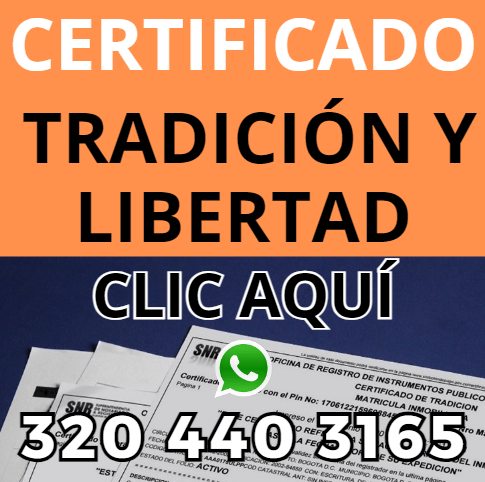

# Certificado de Tradición y Libertad en Bogotá

### ¿Necesitas tu Certificado de Tradición y Libertad en Bogotá?

💬 **Te ayudamos a expedirlo fácilmente.**

Escríbenos por WhatsApp al [CLIC AQUI](https://wa.me/573204403165?text=Github-Hola%20ayudame%20a%20expedir%20un%20certificado%20de%20tradicion%20y%20libertad).

¡Estamos listos para ayudarte!

El **Certificado de Tradición y Libertad en Bogotá** es un documento oficial emitido por la Superintendencia de Notariado y Registro de Colombia. Este certificado contiene el historial jurídico de un inmueble, proporcionando información clave sobre la propiedad, tales como su titularidad, gravámenes, hipotecas, embargos y otros aspectos relevantes.

## ¿Para qué sirve el Certificado de Tradición y Libertad?

Este documento es esencial para quienes desean comprar o vender una propiedad, ya que permite verificar que el inmueble no tenga problemas legales, deudas, o limitaciones que puedan afectar la transacción. Además, es un requisito fundamental para la realización de trámites notariales y bancarios.

## ¿Qué información contiene el Certificado de Tradición y Libertad?

El certificado incluye los siguientes datos importantes:

- **Identificación del inmueble**: Número de matrícula inmobiliaria.
- **Propietarios actuales y anteriores**: Registro de todos los titulares de la propiedad.
- **Limitaciones y gravámenes**: Hipotecas, embargos o cualquier otra afectación que restrinja el uso del inmueble.
- **Historial de transacciones**: Transferencias de dominio o cambios en la titularidad de la propiedad.
  
## ¿Cómo obtener el Certificado de Tradición y Libertad en Bogotá?

Para obtener el **Certificado de Tradición y Libertad en Bogotá**, puedes seguir los siguientes pasos:

1. **Acceder a la página web de la Superintendencia de Notariado y Registro**.
2. Ingresar el **número de matrícula inmobiliaria** del inmueble que deseas consultar.
3. Realizar el pago correspondiente por el trámite.
4. Descargar el certificado en formato PDF una vez que esté disponible.

### Costo del Certificado de Tradición y Libertad

El costo de este documento puede variar dependiendo de la ubicación del inmueble y del tipo de propiedad. Por lo general, oscila entre $16.000 y $20.000 COP. Es importante verificar los valores actualizados directamente en la página oficial de la Superintendencia de Notariado y Registro.

## ¿Cuánto tarda en emitirse el Certificado?

Una vez realizado el pago y la solicitud en línea, el **Certificado de Tradición y Libertad** puede estar disponible para su descarga en pocos minutos. Sin embargo, en algunos casos puede tardar hasta 24 horas.

## Importancia del Certificado de Tradición y Libertad en Bogotá

El **Certificado de Tradición y Libertad** es crucial en cualquier transacción inmobiliaria, ya que garantiza la seguridad legal de la propiedad, previniendo futuros inconvenientes legales para el comprador. Además, es un requisito para créditos hipotecarios y otros procesos financieros.

## Preguntas frecuentes

### ¿Puedo solicitar el Certificado de Tradición y Libertad de cualquier inmueble en Bogotá?
Sí, cualquier persona puede solicitar el certificado, siempre y cuando tenga el número de matrícula inmobiliaria del inmueble.

### ¿Cuánto tiempo es válido el Certificado de Tradición y Libertad?
El certificado refleja el estado jurídico del inmueble al momento de su emisión. Sin embargo, si hay modificaciones posteriores, será necesario solicitar un nuevo certificado actualizado.

### ¿Es necesario tener este certificado para vender una propiedad?
Sí, es un requisito indispensable para cualquier compraventa de inmuebles, ya que el comprador deberá verificar que la propiedad está libre de gravámenes y problemas legales.

---

### Palabras clave importantes:

- Certificado de Tradición y Libertad Bogotá
- Obtener Certificado de Tradición y Libertad
- Matricula inmobiliaria Bogotá
- Documento legal de propiedad

